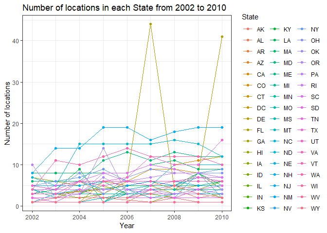
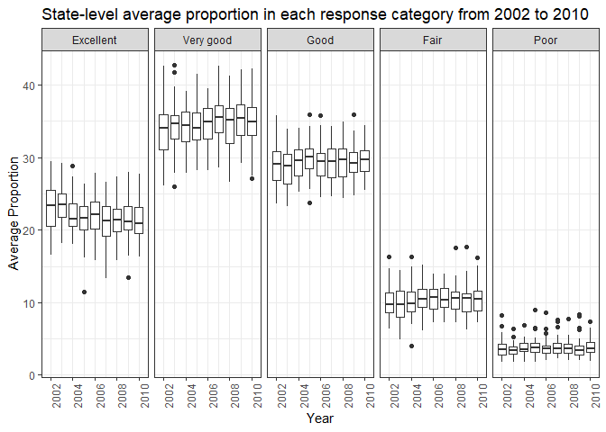
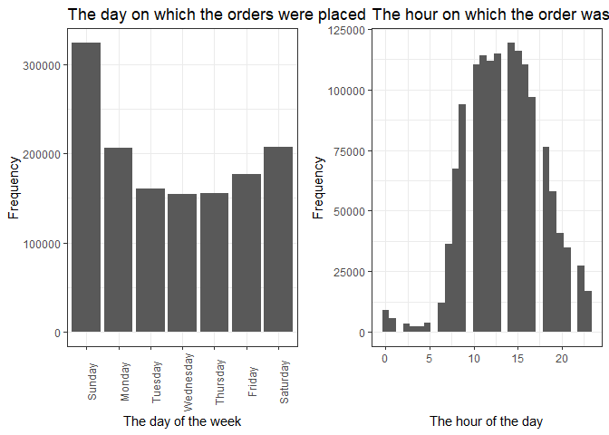
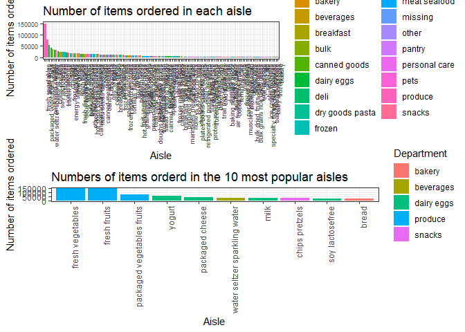
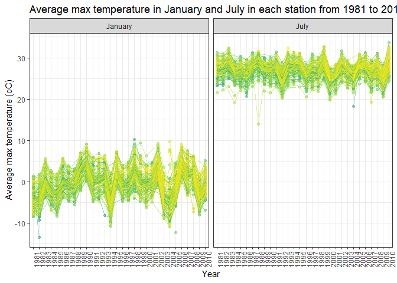
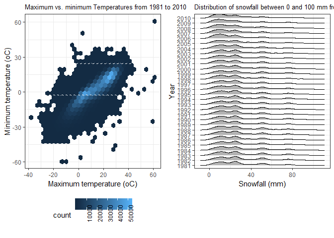

p8105\_hw3\_jy2944
================
Jie Yu
2018-10-11

-   [Problem 1](#problem-1)
    -   [Load data and do some data cleaning](#load-data-and-do-some-data-cleaning)
    -   [Answers based on the dataset](#answers-based-on-the-dataset)
-   [Problem 2](#problem-2)
    -   [Exploration of the dataset](#exploration-of-the-dataset)
    -   [Answers based on the dataset](#answers-based-on-the-dataset-1)
-   [Problem 3](#problem-3)
    -   [Exploration of the dataset](#exploration-of-the-dataset-1)
    -   [Answers based on the dataset](#answers-based-on-the-dataset-2)

Problem 1
=========

This problem uses the BRFSS data.

### Load data and do some data cleaning

``` r
brfss_data = as.tibble(brfss_smart2010) %>%
  janitor::clean_names() %>%
  # format the data to use appropriate variable names
  separate(locationdesc, into = c("state_str", "location"), sep = " - ") %>%
  select(-state_str) %>%
  rename(state_abbr = locationabbr) %>%
  # focus on "Overall Health" topic
  filter(topic == "Overall Health") %>% 
  # remove the variables which I do not need
  select(-(class:question), 
         -sample_size, 
         -(confidence_limit_low:geo_location)) %>%
  # organize responses as a factor taking levels ordered from "Excellent" to "Poor"
  mutate(response = forcats::fct_relevel(factor(response), c("Excellent", "Very good", "Good", "Fair", "Poor")))
```

### Answers based on the dataset

*1. In 2002, which states were observed at 7 locations?*

``` r
brfss_data %>% 
  # filter by year
  filter(year == 2002) %>% 
  # group by state
  group_by(state_abbr) %>% 
  # summarize number of locations in each state
  summarise(n_location = n_distinct(location)) %>% 
  filter(n_location == 7) %>% 
  knitr::kable()
```

| state\_abbr |  n\_location|
|:------------|------------:|
| CT          |            7|
| FL          |            7|
| NC          |            7|

From above table, we find that Connecticut, Florida, North Carolina were observed at 7 loacations in 2002.

*2. Make a “spaghetti plot” that shows the number of locations in each state from 2002 to 2010.*

``` r
brfss_data %>% 
  # group by year and state
  group_by(year, state_abbr) %>% 
  # find the number of distinct location in each year
  distinct(location) %>% 
  summarise(number = n()) %>% 
  # spaghetti plot
  ggplot(aes(x = year, y = number, color = state_abbr)) +
  geom_line() +
  geom_point() +
   labs(
    title = "Number of locations in each State from 2002 to 2010", 
    x = "Year", 
    y = "Number of locations",
    # change the legend name
    color = "State"
    ) 
```



We can learn from the above plot that there existed a state being observed quite a lot distinct locations in year 2007 and 2010 (more than 40 locations), but it is difficult to distinguish which state it is from this spaghetti plot. Thus, let us use the following code chunk to find out it.

``` r
brfss_data %>% 
  group_by(year, state_abbr) %>% 
  distinct(location) %>% 
  summarise(number = n()) %>%
  filter(year == 2007 | year == 2010) %>% 
  # arrange in a decreasing order
  arrange(desc(number)) %>% 
  head(5) %>% 
  knitr::kable()
```

|  year| state\_abbr |  number|
|-----:|:------------|-------:|
|  2007| FL          |      44|
|  2010| FL          |      41|
|  2010| NJ          |      19|
|  2007| NJ          |      16|
|  2010| TX          |      16|

We get to know from the above table that Florida is the very state being observed more than 40 locations in year 2007 and 2010.

*3. Make a table showing, for the years 2002, 2006, and 2010, the mean and standard deviation of the proportion of “Excellent” responses across locations in NY State.*

``` r
brfss_data %>% 
  # filter year
  filter(year == 2002 | year == 2006 | year == 2010) %>% 
  # filter NY
  filter(state_abbr == "NY") %>% 
  # filter "Excellent"
  filter(response == "Excellent") %>% 
  # group by state and year
  group_by(state_abbr, year) %>% 
  summarize(
    excellent_mean = mean(data_value, na.rm = TRUE),
    excellent_sd = sd(data_value, na.rm = TRUE)
    ) %>%
  knitr::kable(digits = 2)
```

| state\_abbr |  year|  excellent\_mean|  excellent\_sd|
|:------------|-----:|----------------:|--------------:|
| NY          |  2002|            24.04|           4.49|
| NY          |  2006|            22.53|           4.00|
| NY          |  2010|            22.70|           3.57|

The above table suggests: among the years 2002, 2006, and 2010, the mean of the proportion of "Excellent" responses in NY state was highest in year 2002 (24.04%), and lowest in year 2006 (22.53%); the varibility of the proportion was biggest in year 2002 (±4.49%) and smallest in year 2010 (±3.57%).

*4. For each year and state, compute the average proportion in each response category (taking the average across locations in a state). Make a five-panel plot that shows, for each response category separately, the distribution of these state-level averages over time.*

``` r
brfss_data %>% 
  # group by year, state, and response
  group_by(year, state_abbr, response) %>% 
  summarise(mean = mean(data_value, na.rm = TRUE)) %>% 
  # Boxplot, group by year
  ggplot(aes(x = year, y = mean, group = year)) +
  geom_boxplot() +
  labs(
    title = "State-level average proportion in each response category from 2002 to 2010", 
    x = "Year", 
    y = "Average Proportion"
    ) +
  # faceting: divide the plot into 5 subplots based on response category
  facet_grid(. ~ response) +
  theme(axis.text.x = element_text(angle = 90))
```



In each response category, the distributions of state-level average proportion are not much different between years, but the occurance of outliers is different in each year. There are more outliers appeared in the "Poor" response category compared to other category.

Problem 2
=========

This problem uses the Instacart data.

### Exploration of the dataset

``` r
# load the data
instacart_data = as.tibble(instacart) %>%
   janitor::clean_names()

# find the number of unique users
instacart_data %>% 
  distinct(user_id) %>% 
  nrow()
## [1] 131209

# find the number of distinct departments
instacart_data %>% 
  distinct(department_id, department) %>% 
  nrow()
## [1] 21

# find the number of distinct products
instacart_data %>% 
  distinct(product_id, product_name) %>% 
  nrow()
## [1] 39123

# barplot: the day of the week on which the orders were placed
barplot_day = instacart_data %>% 
  mutate(
    order_dow = factor(order_dow, levels = c(0:6)),
    order_dow = recode(order_dow, "0" = "Sunday", "1" = "Monday", "2" = "Tuesday", "3" = "Wednesday", "4" = "Thursday", "5" = "Friday", "6" = "Saturday")
    ) %>% 
  ggplot(aes(x = order_dow)) +
  geom_bar() +
  labs(
    title = "The day on which the orders were placed",
    x = "The day of the week",
    y = "Frequency"
  ) +
  theme(axis.text.x = element_text(angle = 90))
  

# histogram: the hour of the day on which the order was placed 
histogram_hour = instacart_data %>% 
  ggplot(aes(x = order_hour_of_day)) +
  geom_histogram() +
  labs(
    title = "The hour on which the order was placed",
    x = "The hour of the day",
    y = "Frequency"
    )

barplot_day + histogram_hour
## `stat_bin()` using `bins = 30`. Pick better value with `binwidth`.
```



The dataset contains information related to the Instacart online grocery shopping. It is consisted by 1384617 observations of 131209 unique users, where each row in the dataset is a product from an order placed by an user. There are 15 variables, which contain the information of the product in each row. Key variables include "department", "aisle", "product name", "the day of the week on which the order was placed" (`order_dow`), and "the hour of the day on which the order was placed" (`order_hour_of_day`).

This online grocery is consisted of 21 departments, and 39123 kinds of distinct products can be chosen from it.

The above plots show that Sunday is the day of the week on which people place their orders most, and the majority of people prefer to place their order between 10 a.m. and 5 p.m.

### Answers based on the dataset

*1. How many aisles are there, and which aisles are the most items ordered from?*

``` r
# find the number of distinct aisles
instacart_data %>% 
  distinct(aisle_id, aisle) %>% 
  nrow()
## [1] 134

# find which aisles are the most items ordered from
instacart_data %>% 
  group_by(aisle_id, aisle) %>% 
  summarize(n = n()) %>% 
  # arrange in a decreasing order
  arrange(desc(n)) %>% 
  head(5) %>% 
  rename("Aisle id" = aisle_id, "Aisle Name" = aisle, "Number" = n) %>%
  knitr::kable()
```

|  Aisle id| Aisle Name                 |  Number|
|---------:|:---------------------------|-------:|
|        83| fresh vegetables           |  150609|
|        24| fresh fruits               |  150473|
|       123| packaged vegetables fruits |   78493|
|       120| yogurt                     |   55240|
|        21| packaged cheese            |   41699|

There are 134 distinct aisles. The above table shows the top 5 most popular aisles. Among them, "fresh vegetables" and "fresh fruits" are the aisles where most items are ordered from, followed by "packaged vegetable fruit", "yogurt", and "packaged cheese".

*2. Make a plot that shows the number of items ordered in each aisle. Order aisles sensibly, and organize your plot so others can read it.*

``` r
aisle_plot = instacart_data %>% 
  # group by department and aisle
  group_by(department, aisle) %>% 
  summarise(number = n()) %>% 
  # barplot
  # reorder the aisle by number of items
  ggplot(aes(x = reorder(aisle, -number), y = number, fill = department)) +
  geom_bar(stat = "identity") +
  labs(
    title = "Number of items ordered in each aisle",
    x = "Aisle",
    y = "Number of items ordered",
    fill = "Department"
  ) +
  viridis::scale_color_viridis(
    discrete = TRUE,
    name = "Aisle"
    ) +
  theme(
    axis.text.x = element_text(angle = 90, hjust = 1),
    axis.text = element_text(size = 7),
    legend.position = "none"
    )

insta_new = instacart_data %>% 
  # group by department and aisle
  group_by(department, aisle) %>% 
  summarise(number = n()) %>% 
  arrange(desc(number))

top_10_aisle = insta_new[c(1:10), ] %>% 
  # barplot
  # reorder the aisle by number of items
  ggplot(aes(x = reorder(aisle, -number), y = number, fill = department)) +
  geom_bar(stat = "identity") +
  labs(
    title = "Numbers of items orderd in the 10 most popular aisles",
    x = "Aisle",
    y = "Number of items ordered",
    fill = "Department"
  ) +
  viridis::scale_color_viridis(
    discrete = TRUE,
    name = "Aisle"
    ) +
  theme(
    axis.text.x = element_text(angle = 30, hjust = 1),
    legend.position = "right"
    )

gridExtra::grid.arrange(aisle_plot, top_10_aisle, heights = c(3, 3), nrow = 2 )
```



From the above barplot, we can find that the three most popular aisles are "fresh vegetables", "fresh fruits", and "packaged vegetable fruits", and they all belong to the department "Produce". "Yogurt" and "packaged cheese" are the fourth and fifth most popular aisles, and both of them belong to the department "Dairy eggs".

*3. Make a table showing the most popular item in each of the aisles “baking ingredients”, “dog food care”, and “packaged vegetables fruits”.*

``` r
instacart_data %>% 
  # filter the three aisles
  filter(aisle == "baking ingredients" | aisle == "dog food care" | aisle == "packaged vegetables fruits") %>%
  group_by(aisle, product_name) %>% 
  summarize(number = n()) %>% 
  arrange(desc(number)) %>%
  # display the most popular item in each aisle
  top_n(1) %>% 
  rename("Aisle" = aisle, "Product Name" = product_name, "Sale Volume" = number) %>%
  knitr::kable()
```

    ## Selecting by number

| Aisle                      | Product Name                                  |  Sale Volume|
|:---------------------------|:----------------------------------------------|------------:|
| packaged vegetables fruits | Organic Baby Spinach                          |         9784|
| baking ingredients         | Light Brown Sugar                             |          499|
| dog food care              | Snack Sticks Chicken & Rice Recipe Dog Treats |           30|

"Light Brown Sugar" is the most popular item in the aisle "Baking Ingredients" with a sale volume of 499 packets. "Snack Sticks Chicken & Rice Recipe Dog Treats" is the most popular item in the aisle "Dog Food Care" with a sale volume of 30 bags. In the aisle “Packaged Vegetables fruits”, the most popular item is "Organic Baby Spinach" and it reaches a sale of 9784 packages.

*4. Make a table showing the mean hour of the day at which Pink Lady Apples and Coffee Ice Cream are ordered on each day of the week; format this table for human readers (i.e. produce a 2 x 7 table)*

``` r
instacart_data %>% 
  # filter the 2 products
  filter(product_name == "Pink Lady Apples" | product_name == "Coffee Ice Cream") %>%
  # order_dow:  the day of the week on which the order was placed
  group_by(product_name, order_dow) %>% 
  summarize(mean_hour = mean(order_hour_of_day)) %>%
  mutate(
    order_dow = factor(order_dow),
    # make the values in `order_dow` readable
    order_dow = recode(order_dow, "0" = "Sunday", "1" = "Monday", "2" = "Tuesday", "3" = "Wednesday", "4" = "Thursday", "5" = "Friday", "6" = "Saturday")
    ) %>%
  # format the table for human readers
  spread(key = order_dow, value = mean_hour) %>%
  rename("Product Name" = product_name) %>%
  knitr::kable(digits = 2)
```

| Product Name     |  Sunday|  Monday|  Tuesday|  Wednesday|  Thursday|  Friday|  Saturday|
|:-----------------|-------:|-------:|--------:|----------:|---------:|-------:|---------:|
| Coffee Ice Cream |   13.77|   14.32|    15.38|      15.32|     15.22|   12.26|     13.83|
| Pink Lady Apples |   13.44|   11.36|    11.70|      14.25|     11.55|   12.78|     11.94|

As to Coffee Ice Cream, the mean hour for it to be ordered is between noon and 4 p.m across the week. As to Pink Lady Apples, the mean hour for it to be ordered is between 11 a.m. and 3 p.m. across the week.

Problem 3
=========

This problem uses the NY NOAA data.

### Exploration of the dataset

``` r
# load data
noaa_data = as.tibble(ny_noaa) %>%
  janitor::clean_names()

# look at the data
skimr::skim(noaa_data)
## Skim summary statistics
##  n obs: 2595176 
##  n variables: 7 
## 
## -- Variable type:character -----------------------------------------------------------------------------
##  variable missing complete       n min max empty n_unique
##        id       0  2595176 2595176  11  11     0      747
##      tmax 1134358  1460818 2595176   1   4     0      532
##      tmin 1134420  1460756 2595176   1   4     0      548
## 
## -- Variable type:Date ----------------------------------------------------------------------------------
##  variable missing complete       n        min        max     median
##      date       0  2595176 2595176 1981-01-01 2010-12-31 1997-01-21
##  n_unique
##     10957
## 
## -- Variable type:integer -------------------------------------------------------------------------------
##  variable missing complete       n  mean     sd  p0 p25 p50 p75  p100
##      prcp  145838  2449338 2595176 29.82  78.18   0   0   0  23 22860
##      snow  381221  2213955 2595176  4.99  27.22 -13   0   0   0 10160
##      snwd  591786  2003390 2595176 37.31 113.54   0   0   0   0  9195
##      hist
##  ▇▁▁▁▁▁▁▁
##  ▇▁▁▁▁▁▁▁
##  ▇▁▁▁▁▁▁▁

# percent of missing data in precipitation (%)
(sum(is.na(noaa_data$prcp)) / nrow(noaa_data)) * 100
## [1] 5.61958
# percent of missing data in snowfall (%)
(sum(is.na(noaa_data$snow)) / nrow(noaa_data)) * 100
## [1] 14.6896
# percent of missing data in snow depth (%)
(sum(is.na(noaa_data$snwd)) / nrow(noaa_data)) * 100
## [1] 22.80331
# percent of missing data in maximum temperature (%)
(sum(is.na(noaa_data$tmax)) / nrow(noaa_data)) * 100
## [1] 43.71025
# percent of missing data in minimum temperature (%)
(sum(is.na(noaa_data$tmin)) / nrow(noaa_data)) * 100
## [1] 43.71264

# find the number of observations which are missing at least one variable
noaa_data %>% 
  filter(is.na(prcp) | is.na(snow) | is.na(snwd) | is.na(tmax) | is.na(tmin)) %>% 
  nrow()
## [1] 1372743
# the percent of observations which have missing data (%)
((noaa_data %>% filter(is.na(prcp) | is.na(snow) | is.na(snwd) | is.na(tmax) | is.na(tmin)) %>% nrow()) / nrow(noaa_data)) * 100
## [1] 52.89595
```

This dataset contains daily weather information observed by each New York state weather station from January 1, 1981 through December 31, 2010. It is consisted by 2595176 observations with information across 7 variables. Key variables include the date of observation, precipitation (tenths of mm), snowfall (mm), maximum temperature (tenths of degrees centigrade), and minimum temperature (tenths of degrees centigrade).

One big issue of this dataset is that it contains extensive missing data. In variable precipitation, snowfall, snow depth, maximum temperature, and minimum temperature, the missing data accounts for 5.62%, 14.69%, 22.8%, 43.71%, and 43.71%, respectively. There are 1372743 observations are missing at least information of one weather variable, which accounts for 52.9% of the all observations (over a half).

### Answers based on the dataset

*1. Do some data cleaning. Create separate variables for year, month, and day. Ensure observations for temperature, precipitation, and snowfall are given in reasonable units. For snowfall, what are the most commonly observed values? Why?*

``` r
# data cleaning
noaa_data = noaa_data %>%
  janitor::clean_names() %>%
  # create separate variables for year, month, and day
  separate(date, into = c("year", "month", "day")) %>%
  # change the units to one-tenth
  mutate(
    prcp = prcp / 10, 
    tmax = as.numeric(tmax) / 10, 
    tmin = as.numeric(tmin) / 10
  ) 

# find the most commonly ovserved values for snowfall
noaa_data %>% 
  group_by(snow) %>% 
  summarize(n = n()) %>% 
  arrange(desc(n)) %>% 
  head(5) %>% 
  knitr::kable()
```

|  snow|        n|
|-----:|--------:|
|     0|  2008508|
|    NA|   381221|
|    25|    31022|
|    13|    23095|
|    51|    18274|

The most commonly observed value for snowfall is 0 mm, because it does not snow in most days of the year in New York.

*2. Make a two-panel plot showing the average max temperature in January and in July in each station across years. Is there any observable / interpretable structure? Any outliers?*

``` r
noaa_data %>% 
  # filter by January and July
  filter(month == "01" | month == "07") %>%
  # make month name readable
  mutate(month = recode(month, "01" = "January", "07" = "July")) %>%
  # group by id (station), year, month
  group_by(id, year, month) %>% 
  summarise(mean_tmax = mean(tmax, na.rm = TRUE)) %>% 
  # spaghetti plot
  ggplot(aes(x = year, y = mean_tmax, group = id, color = id)) + 
  geom_point(alpha = 0.5) + 
  geom_line(alpha = 0.5) + 
  labs(
    title = "Average max temperature in January and July in each station from 1981 to 2010",
    x = "Year",
    y = "Average max temperature (ºC)"
  ) +
  viridis::scale_color_viridis(discrete = TRUE) +
  # facetting by month
  facet_grid(. ~ month) +
  theme(
    axis.text.x = element_text(angle = 90),
    legend.position = "none"
    )
```



We can learn from above plot that the average max temperature in January were lower a lot than that in July. The average max temperature in January by station across years centered around 0 ºC, and were between -10 ºC and 10 ºC, while the average max temperature in July by station across years centered around 28 ºC, and were between 20 ºC and 35 ºC. There are a few outliers in both the distributions of January and July.

*3. Make a two-panel plot showing (i) tmax vs tmin for the full dataset (note that a scatterplot may not be the best option); and (ii) make a plot showing the distribution of snowfall values greater than 0 and less than 100 separately by year.*

``` r
tmax_tmin_hex = noaa_data %>% 
  ggplot(aes(x = tmax, y = tmin)) +
  geom_hex() +
  labs(
    title = "Maximum vs. minimum Temperatures from 1981 to 2010", 
    x = "Maximum temperature (ºC)", 
    y = "Minimum temperature (ºC)"
  ) +
  theme(legend.position = "bottom")

snow_ridge = noaa_data %>% 
  filter(snow > 0 & snow < 100) %>% 
  ggplot(aes(x = snow, y = year)) +
  geom_density_ridges(scale = .85) +
  labs(
    title = "Distribution of snowfall between 0 and 100 mm from 1981 to 2010",
    x = "Snowfall (mm)",
    y = "Year"
    )
  
tmax_tmin_hex + snow_ridge
```

    ## Warning: Removed 1136276 rows containing non-finite values (stat_binhex).

    ## Picking joint bandwidth of 3.76



We can learn from the plot on the left that the maximum temperatures was positively correlated to the minimum temperatures at New York across years. The plot on the right shows that the distributions of snowfall values from 0 to 100 mm were all skewed to right in each year. From 0 to 100 mm (not include 0 and 100 mm), the most commonly observed values of snowfall were about 10 mm and 25 mm.
