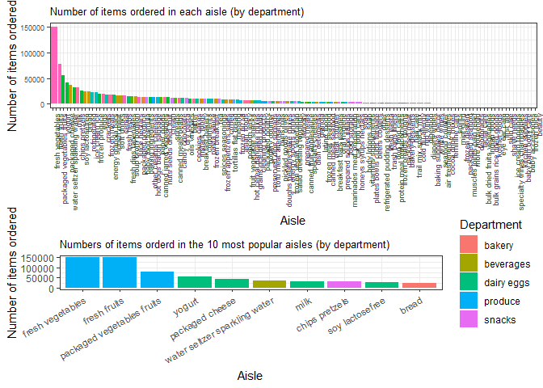

p8105\_hw3\_jy2944
================
Jie Yu
2018-10-11

-   [Problem 1](#problem-1)
    -   [Load data and do some data cleaning](#load-data-and-do-some-data-cleaning)
    -   [Answers based on the dataset](#answers-based-on-the-dataset)
-   [Problem 2](#problem-2)
    -   [Description of the dataset](#description-of-the-dataset)
    -   [Answers based on the dataset](#answers-based-on-the-dataset-1)

Problem 1
=========

This problem uses the BRFSS data.

### Load data and do some data cleaning

``` r
data("brfss_smart2010")

brfss_data = brfss_smart2010 %>%
  janitor::clean_names() %>%
  # format the data to use appropriate variable names
  separate(locationdesc, into = c("state_str", "location"), sep = " - ") %>%
  select(-state_str) %>%
  rename(state_abbr = locationabbr) %>%
  # focus on "Overall Health" topic
  filter(topic == "Overall Health") %>% 
  # remove the variables which I do not need
  select(-(class:question), 
         -sample_size, 
         -(confidence_limit_low:geo_location)) %>%
  # organize responses as a factor taking levels ordered from "Excellent" to "Poor"
  mutate(response = forcats::fct_relevel(factor(response), c("Excellent", "Very good", "Good", "Fair", "Poor")))
```

### Answers based on the dataset

*1. In 2002, which states were observed at 7 locations?*

``` r
brfss_data %>% 
  # filter by year
  filter(year == 2002) %>% 
  # group by state
  group_by(state_abbr) %>% 
  # summarize number of locations in each state
  summarise(n_location = n_distinct(location)) %>% 
  filter(n_location == 7) %>% 
  knitr::kable()
```

| state\_abbr |  n\_location|
|:------------|------------:|
| CT          |            7|
| FL          |            7|
| NC          |            7|

From above table, we find that Connecticut, Florida, North Carolina were observed at 7 loacations in 2002.

*2. Make a “spaghetti plot” that shows the number of locations in each state from 2002 to 2010.*

``` r
brfss_data %>% 
  # group by year and state
  group_by(year, state_abbr) %>% 
  # find the number of distinct location in each year
  distinct(location) %>% 
  summarise(number = n()) %>% 
  # spaghetti plot
  ggplot(aes(x = year, y = number, color = state_abbr)) +
  geom_line() +
  geom_point() +
   labs(
    title = "Number of locations in each State from 2002 to 2010", 
    x = "Year", 
    y = "Number of locations",
    # change the legend name
    color = "State"
    ) 
```


We can learn from the above plot that there existed a state being observed quite a lot distinct locations in year 2007 and 2010 (more than 40 locations), but it is difficult to distinguish which state it is from this spaghetti plot. Thus, let us use the following code chunk to find out it.

``` r
brfss_data %>% 
  group_by(year, state_abbr) %>% 
  distinct(location) %>% 
  summarise(number = n()) %>%
  filter(year == 2007 | year == 2010) %>% 
  # arrange in a decreasing order
  arrange(desc(number)) %>% 
  head(5) %>% 
  knitr::kable()
```

|  year| state\_abbr |  number|
|-----:|:------------|-------:|
|  2007| FL          |      44|
|  2010| FL          |      41|
|  2010| NJ          |      19|
|  2007| NJ          |      16|
|  2010| TX          |      16|

We get to know from the above table that Florida is the very state being observed more than 40 locations in year 2007 and 2010.

*3. Make a table showing, for the years 2002, 2006, and 2010, the mean and standard deviation of the proportion of “Excellent” responses across locations in NY State.*

``` r
brfss_data %>% 
  # filter year
  filter(year == 2002 | year == 2006 | year == 2010) %>% 
  # filter NY
  filter(state_abbr == "NY") %>% 
  # filter "Excellent"
  filter(response == "Excellent") %>% 
  # group by state and year
  group_by(state_abbr, year) %>% 
  summarize(
    excellent_mean = mean(data_value, na.rm = TRUE),
    excellent_sd = sd(data_value, na.rm = TRUE)
    ) %>%
  knitr::kable(digits = 2)
```

| state\_abbr |  year|  excellent\_mean|  excellent\_sd|
|:------------|-----:|----------------:|--------------:|
| NY          |  2002|            24.04|           4.49|
| NY          |  2006|            22.53|           4.00|
| NY          |  2010|            22.70|           3.57|

The above table suggests: among the years 2002, 2006, and 2010, the mean of the proportion of "Excellent" responses in NY state was highest in year 2002 (24.04%), and lowest in year 2006 (22.53%); the varibility of the proportion was biggest in year 2002 (±4.49%) and smallest in year 2010 (±3.57%).

*4. For each year and state, compute the average proportion in each response category (taking the average across locations in a state). Make a five-panel plot that shows, for each response category separately, the distribution of these state-level averages over time.*

``` r
brfss_data %>% 
  # group by year, state, and response
  group_by(year, state_abbr, response) %>% 
  summarise(mean = mean(data_value, na.rm = TRUE)) %>% 
  # Boxplot, group by year
  ggplot(aes(x = year, y = mean, group = year)) +
  geom_boxplot() +
  labs(
    title = "State-level average proportion in each response category from 2002 to 2010", 
    x = "Year", 
    y = "Average Proportion"
    ) +
  # faceting: divide the plot into 5 subplots based on response category
  facet_grid(. ~ response) +
  theme(axis.text.x = element_text(angle = 90))
```


In each response category, the distributions of state-level average proportion are not much different between years, but the occurance of outliers is different in each year. There are more outliers appeared in the "Poor" response category compared to other category.

Problem 2
=========

This problem uses the Instacart data.

Load data

``` r
instacart_data = as.tibble(p8105.datasets::instacart) %>%
   janitor::clean_names()
```

### Description of the dataset

### Answers based on the dataset

*1. How many aisles are there, and which aisles are the most items ordered from?*

``` r
# find the number of distinct aisles
instacart_data %>% 
  distinct(aisle_id, aisle) %>% 
  nrow()
## [1] 134

# find which aisles are the most items ordered from
instacart_data %>% 
  group_by(aisle_id, aisle) %>% 
  summarize(n = n()) %>% 
  # arrange in a decreasing order
  arrange(desc(n)) %>% 
  head(5) %>% 
  knitr::kable()
```

|  aisle\_id| aisle                      |       n|
|----------:|:---------------------------|-------:|
|         83| fresh vegetables           |  150609|
|         24| fresh fruits               |  150473|
|        123| packaged vegetables fruits |   78493|
|        120| yogurt                     |   55240|
|         21| packaged cheese            |   41699|

There are 134 distinct aisles. The above table shows the top 5 most popular aisles. Among them, "fresh vegetables" and "fresh fruits" are the aisles where most items are ordered from, followed by "packaged vegetable fruit", "yogurt", and "packaged cheese".

*2. Make a plot that shows the number of items ordered in each aisle. Order aisles sensibly, and organize your plot so others can read it.*

``` r
instacart_data %>% 
  group_by(aisle_id, aisle) %>% 
  summarise(number = n()) %>% 
  mutate(aisle = forcats::fct_reorder(aisle, number)) %>%
  ggplot(aes(x = aisle, y = number, fill = aisle)) +
  geom_bar(stat = "identity") +
  labs(
    title = "Number of items ordered in each aisle",
    x = "Aisle",
    y = "Number of items ordered"
  ) +
  viridis::scale_color_viridis(
    discrete = TRUE,
    name = "Aisle"
    ) +
  theme(
    axis.text.x = element_text(angle = 90),
    legend.position = "none"
    )
```



Comments?

*3. Make a table showing the most popular item in each of the aisles “baking ingredients”, “dog food care”, and “packaged vegetables fruits”.*

``` r
instacart_data %>% 
  # filter the three aisles
  filter(aisle == "baking ingredients" | aisle == "dog food care" | aisle == "packaged vegetables fruits") %>%
  group_by(aisle, product_name) %>% 
  summarize(number = n()) %>% 
  # display the most popular item in each aisle
  top_n(1, number) %>% 
  knitr::kable()
```

| aisle                      | product\_name                                 |  number|
|:---------------------------|:----------------------------------------------|-------:|
| baking ingredients         | Light Brown Sugar                             |     499|
| dog food care              | Snack Sticks Chicken & Rice Recipe Dog Treats |      30|
| packaged vegetables fruits | Organic Baby Spinach                          |    9784|

"Light Brown Sugar" is the most popular item in the aisle "Baking Ingredients" with a sale volume of 499 packets. "Snack Sticks Chicken & Rice Recipe Dog Treats" is the most popular item in the aisle "Dog Food Care" with a sale volume of 30 bags. In the aisle “Packaged Vegetables fruits”, the most popular item is "Organic Baby Spinach" and it reaches a sale of 9784 packages.

*4. Make a table showing the mean hour of the day at which Pink Lady Apples and Coffee Ice Cream are ordered on each day of the week; format this table for human readers (i.e. produce a 2 x 7 table)*

``` r
instacart_data %>% 
  # filter the 2 products
  filter(product_name == "Pink Lady Apples" | product_name == "Coffee Ice Cream") %>%
  # order_dow:  the day of the week on which the order was placed
  group_by(product_name, order_dow) %>% 
  summarize(mean_hour = mean(order_hour_of_day)) %>%
  mutate(
    order_dow = factor(order_dow),
    # make the values in `order_dow` readable
    order_dow = recode(order_dow, "0" = "Sunday", "1" = "Monday", "2" = "Tuesday", "3" = "Wednesday", "4" = "Thursday", "5" = "Friday", "6" = "Saturday")
    ) %>%
  # format the table for human readers
  spread(key = order_dow, value = mean_hour) %>%
  knitr::kable(digits = 2)
```

| product\_name    |  Sunday|  Monday|  Tuesday|  Wednesday|  Thursday|  Friday|  Saturday|
|:-----------------|-------:|-------:|--------:|----------:|---------:|-------:|---------:|
| Coffee Ice Cream |   13.77|   14.32|    15.38|      15.32|     15.22|   12.26|     13.83|
| Pink Lady Apples |   13.44|   11.36|    11.70|      14.25|     11.55|   12.78|     11.94|

As to Coffee Ice Cream, the mean hour for it to be ordered is highest on Tuesday (15.38 hours), and lowest on Friday (12.26 hours). As to Pink Lady Apples, the mean hour for it to be ordered is highest on Wednesday (14.25 hours), and lowest on Monday (11.36 hours).
